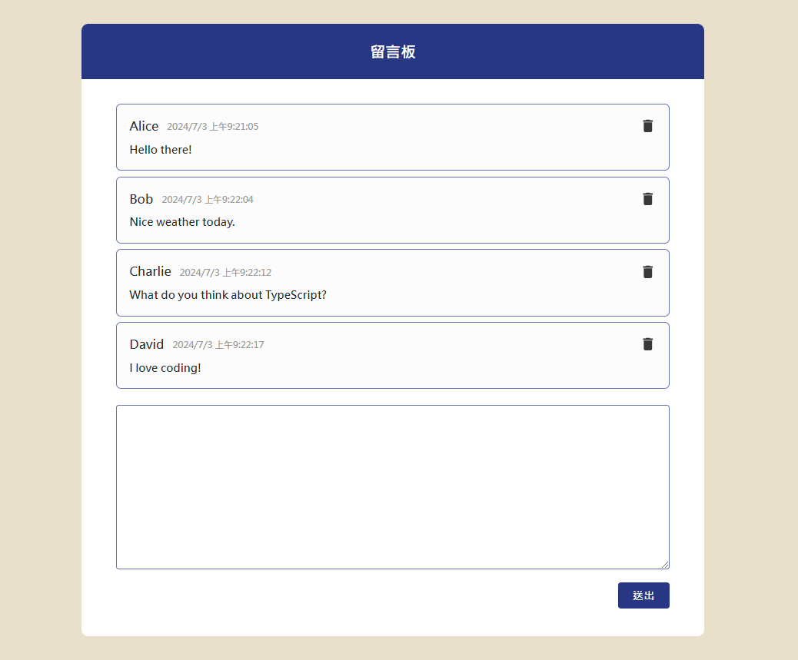

# Message Board


### Backend Server - [Message Board Api TypeScript](https://github.com/yuhexiong/message-board-api-typescript)
A webpage for leaving message using React Next.js.  


## Overview

- Language: TypeScript v5
- Web FrameWork: Next.js v14.2.4


## Run

### install dependencies

```bash
npm install
```


### run

```bash
npm run dev
```

## Pages


### home

```bash
localhost:3000
```

- submit message and delete message operations



